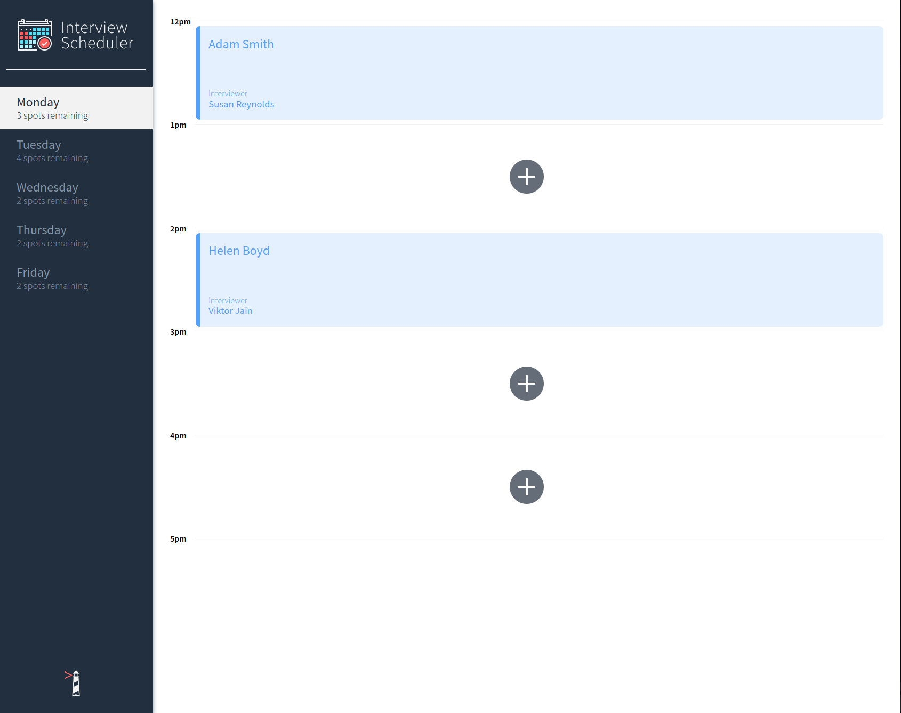
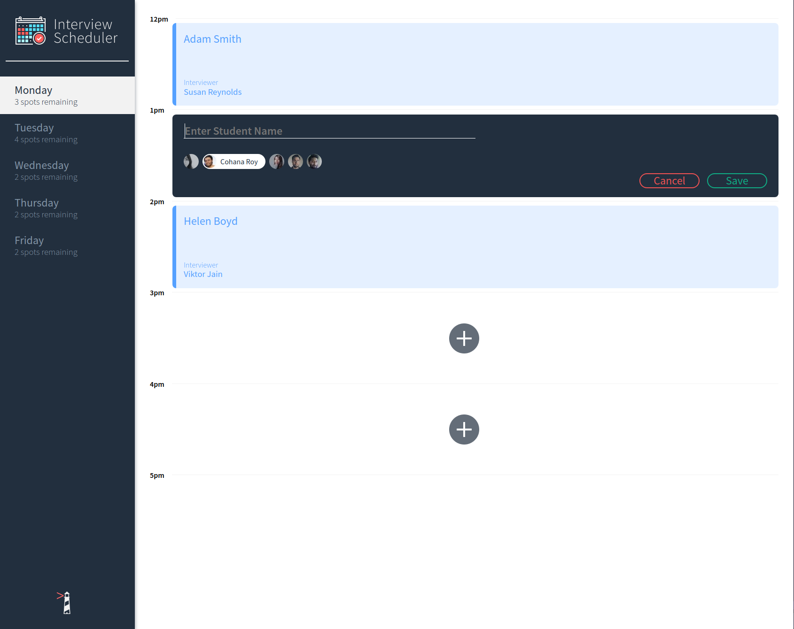
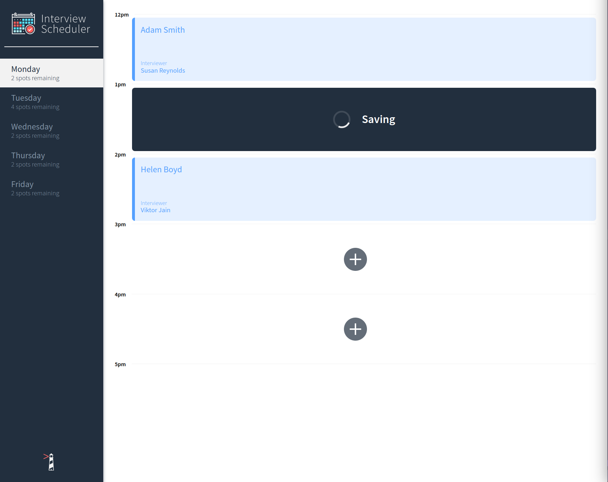

# Interview Scheduler

Interview Scheduler is a single-page application built using React, Axios, Storybook, Jest, Cypress, and React Testing Library. Users can create, edit, and delete appointments.

## Screenshots





## Dependencies

- Node.js
- Axios
- classnames
- normalize.css
- React
- react-dom
- react-hooks-testing-library
- react-scripts

## Setup

Install dependencies with `npm install`.

## Running API server

[Follow instructions here](https://github.com/alou64/scheduler-api) to run the API server.

## Running Webpack Development Server

```sh
npm start
```

## Running Jest Test Framework

```sh
npm test
```

## Running Storybook Visual Testbed

```sh
npm run storybook
```
